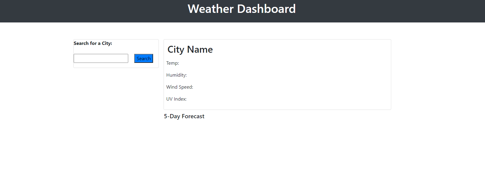

# Weather Dashboard

## Description

I created this dashboard to demonstrate using Ajax to make api calls. This app will provide you the current weather, and 5 day forecase of any city that you enter. The city can be any city in the world, the app will also display the country the city is located in. It will also save up to 8 searches in history, which can be recalled by click on the appropriate button for the city.

## User Story

```
AS A traveler
I WANT to see the weather outlook for multiple cities
SO THAT I can plan a trip accordingly
```

## Acceptance Criteria

```
GIVEN a weather dashboard with form inputs
WHEN I search for a city
THEN I am presented with current and future conditions for that city and that city is added to the search history
WHEN I view current weather conditions for that city
THEN I am presented with the city name, the date, an icon representation of weather conditions, the temperature, the humidity, the wind speed, and the UV index
WHEN I view the UV index
THEN I am presented with a color that indicates whether the conditions are favorable, moderate, or severe
WHEN I view future weather conditions for that city
THEN I am presented with a 5-day forecast that displays the date, an icon representation of weather conditions, the temperature, and the humidity
WHEN I click on a city in the search history
THEN I am again presented with current and future conditions for that city
WHEN I open the weather dashboard
THEN I am presented with the last searched city forecast
```

The following image demonstrates the application functionality:




## Link To the Deployed Site

https://fariskadir.github.io/Weather_Dashboard/
